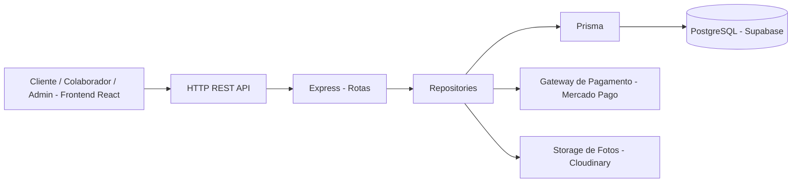
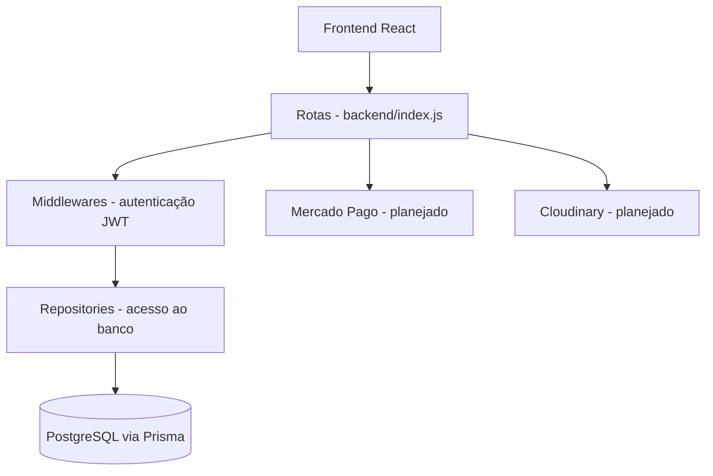
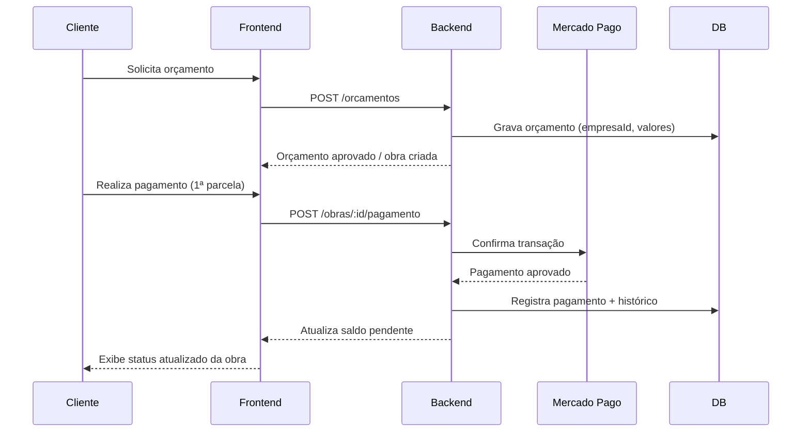

# 🏗️ ObraMaster — Gestão de Obras para Pequenas Empresas

[](#-testes)

## 🚀 Modernizando a gestão de obras com uma plataforma centralizada

### Transforme cadernos, planilhas e grupos de WhatsApp em um histórico único, auditável e acessível para todos os envolvidos na obra.

     

---

# 🛠️ Início rápido (desenvolvimento)

Pré-requisitos:
- Node.js 20+
- Conta no Supabase (banco PostgreSQL já hospedado na nuvem)
- Conta sandbox no Mercado Pago (para testar pagamentos — ainda não integrado)

**Backend** (Node.js + Express):
```
cd backend
npm install
node index.js
```
Por padrão, a API sobe em `http://localhost:3000`.

**Configuração de Ambiente (.env)**:
O backend precisa da string de conexão do banco (Supabase) e do segredo do JWT.

- **Backend**: copie `cp .env.example .env` e preencha `DATABASE_URL` (Supabase) e `JWT_SECRET`. `MERCADOPAGO_ACCESS_TOKEN` e `CLOUDINARY_URL` ainda não são usados no código — ficam reservados para quando essas integrações forem implementadas.
- **Frontend**: ainda não consome a API (é o Hello World padrão do Vite) — variável `VITE_API_URL` será adicionada quando a integração começar.

**Banco de dados** (migrations):
```
cd backend
npx prisma migrate dev
```

**Frontend** (Vite + React):
```
cd frontend
npm install
npm run dev -- --host
```
TailwindCSS ainda **não** está instalado no frontend (planejado, não feito).

**Testes** (backend):
```
cd backend
npm test
```
O frontend ainda não tem testes configurados.

---

# 📌 Sobre o Projeto

**ObraMaster** é uma plataforma web multiempresa (SaaS) de gestão de obras, voltada para pequenas empresas de construção e reforma que hoje controlam tudo manualmente.

> 🎯 **Estado atual**: escopo, casos de uso, regras de negócio e arquitetura definidos; backend com autenticação funcionando (login, dados do usuário logado, troca de senha); frontend ainda no Hello World inicial.

## 🎯 Problema Resolvido

### Antes:
- Cadernos e planilhas soltas
- Combinados feitos só por WhatsApp
- Cliente sem visibilidade da obra
- Cobrança e reajustes sem registro formal
- Conflitos de agenda por falta de controle

### Depois:
- Histórico único e auditável por obra
- Fotos e atualizações de andamento em tempo real
- Pagamento parcelado dentro do próprio app
- Comprovante gerado a partir do histórico registrado
- Validação automática de conflito de agendamento

---

# 🌟 Principais Funcionalidades (visão do produto)

## 👤 Cliente
- Solicitar orçamento com valores pré-calculados por serviço
- Acompanhar o andamento da obra (status, fotos, anotações)
- Pagar pelo app (PIX, crédito ou débito), em parcelas (50% início / 50% conclusão)
- Consultar histórico de obras contratadas

## 🧰 Colaborador
- Conta própria, vinculada às obras em que foi alocado
- Registrar fotos e anotações de andamento
- Visualizar apenas as obras atribuídas a ele

## 👷 Administrador / Dono
- Gerenciar a tabela de preços da empresa
- Criar e gerenciar obras, aprovar orçamentos
- Controlar agendamentos via calendário integrado
- Atualizar o status oficial da obra (Agendada → Em andamento → Concluída)
- Registrar pagamentos e reajustes de valor
- Alocar colaboradores por obra
- Visualizar o histórico de alterações de cada obra

---

# 🧠 Arquitetura do Sistema



---

# 🏗️ Arquitetura em Camadas



---

# 📂 Estrutura de Pastas

```
gestao-de-obras/
│
├── frontend/
│   ├── src/
│   │   ├── pages/
│   │   ├── components/
│   │   ├── hooks/
│   │   ├── services/
│   │   ├── routes/
│   │   └── tests/
│
├── backend/
│   ├── src/
│   │   ├── repositories/
│   │   ├── middlewares/
│   │   └── config/
│   ├── prisma/
│   │   └── schema.prisma
│   └── tests/
│
└── docs/               ← planejado, ainda não criado
    ├── escopo-do-projeto.md
    ├── casos-de-uso/
    └── arquitetura/
```

---

# ⚙️ Stack Tecnológica

## 🎨 Frontend
- React JS + Vite
- TailwindCSS *(planejado, não instalado)*
- React Router *(planejado)*

## 🛠️ Backend
- Node.js + Express
- Prisma ORM v6
- JWT (autenticação)
- Bcrypt (hash de senha)

## 🗄️ Banco de Dados
- PostgreSQL (hospedado no Supabase)
- Modelagem multiempresa (`empresaId` em toda tabela relevante)
- Migrations via Prisma

## 💳 Integrações (planejadas, ainda não implementadas)
- Mercado Pago (pagamentos via PIX/crédito/débito, sandbox)
- Cloudinary (armazenamento de fotos/arquivos)

---

# 🔁 Fluxo Principal do Sistema (visão planejada)



---

# 📋 Regras de Negócio

- **RN1** — Pagamento só é registrado se valor ≤ saldo pendente; sem duplicidade de transação
- **RN2** — Status segue sequência obrigatória Agendada → Em andamento → Concluída, sem retrocesso; só o Admin oficializa a mudança
- **RN3** — Reagendamento só é confirmado se não houver conflito de data/hora com outra obra
- **RN4** — Toda alteração (status, pagamento, agendamento) é registrada em histórico com usuário e data/hora
- **RN6** — Obra não pode ser marcada como "Concluída" com pagamento pendente
- **RN7** — Alteração de status ou agendamento dispara notificação automática ao cliente
- **RN8** — Pagamento padrão dividido em 2 parcelas: 50% na aprovação do orçamento, 50% na conclusão da obra
- **RN9** — Isolamento total de dados entre empresas (multiempresa)

---

# 🗃️ Modelagem de Dados

## ✅ Implementado no banco

### `Empresa`
| Campo | Tipo |
|---|---|
| id | UUID |
| nome | VARCHAR |
| criadoEm | TIMESTAMP |

### `Usuario`
| Campo | Tipo |
|---|---|
| id | UUID |
| empresaId | UUID (FK → Empresa) |
| nome | VARCHAR |
| email | VARCHAR (único) |
| senhaHash | TEXT |
| tipo | ENUM (CLIENTE / COLABORADOR / ADMIN) |
| criadoEm | TIMESTAMP |

## 🔜 Planejado, ainda não criado no banco
`obra`, `obra_evento` (linha do tempo/histórico), `obra_colaborador`, `tabela_preco` — ver detalhamento completo em `docs/escopo-do-projeto.md` (issue de contrato de dados pendente).

---

# 🌐 Endpoints da API

## ✅ Implementados
```
GET   /health                    (status do servidor)
GET   /usuarios                  (lista usuários — protegida)
POST  /auth/login                (login com e-mail/senha, retorna JWT)
GET   /auth/me                   (dados do usuário autenticado — protegida)
PATCH /usuarios/me/senha         (troca da própria senha — protegida)
```

## 🔜 Planejados
```
POST  /auth/register             (cadastro de empresa + admin)
GET   /obras
POST  /obras
GET   /obras/:id
PATCH /obras/:id/status
POST  /obras/:id/andamento       (foto/anotação — Colaborador)
POST  /obras/:id/pagamento       (Admin)
POST  /obras/:id/colaboradores   (alocação — Admin)
GET   /precos
POST  /precos
GET   /agenda
```

---

# 🔐 Segurança

## ✅ Implementado
- Autenticação via JWT
- Hash de senha com Bcrypt
- Rotas privadas protegidas por middleware de autenticação

## 🔜 Planejado
- Isolamento de dados por empresa (multi-tenant) nas rotas de obra
- Dados sensíveis criptografados em trânsito (HTTPS) e repouso
- Sem armazenamento direto de dados bancários — pagamento via gateway externo, só token/ID da transação será salvo
- Conformidade com a LGPD no tratamento de dados pessoais

---

# 🧪 Testes

```
cd backend
npm test
```
Cobre atualmente o fluxo de troca de senha (`/usuarios/me/senha`). Testes de frontend ainda não configurados.

---

# 📈 Roadmap

## ✏️ Fundação do Projeto
- [x] Definição de escopo e visão do produto
- [x] Especificação de casos de uso e regras de negócio
- [x] Modelagem inicial de dados (Empresa, Usuário)
- [x] Estrutura de pastas frontend/backend

## 🔨 Fase 1: MVP
- [x] Login (e-mail/senha) com JWT
- [x] Endpoint de troca de senha
- [ ] Cadastro de empresa + admin (`/auth/register`)
- [ ] Tabela de preços por empresa
- [ ] Cadastro e gestão de obras pelo Admin
- [ ] Calendário/agenda consolidada
- [ ] Registro de andamento (fotos + anotações) pelo Colaborador
- [ ] Alocação de colaboradores por obra
- [ ] Pagamento parcelado (50/50) via PIX/cartão
- [ ] Acompanhamento de obra pelo Cliente
- [ ] Histórico/log de auditoria
- [ ] Frontend: telas de Login e Perfil conectadas à API real

## 🚀 Fase 2: Melhorias (pós-entrega)
- [ ] Chat direto entre dono e cliente
- [ ] Avaliação do serviço prestado
- [ ] Emissão de comprovante/termo em PDF
- [ ] Exportação de relatórios financeiros (PDF/Excel)
- [ ] Tela dedicada de gestão de colaboradores

---

# 🎨 Diferenciais

### Multiempresa
Qualquer empresa de obras pode usar, com dados isolados das demais

### Histórico confiável
Toda alteração registrada com usuário e data/hora — serve como comprovante

### Pensado para o dia a dia da obra
Fotos, anotações e agenda no lugar do caderno e do WhatsApp

### Mobile-first
Feito pra ser usado no celular, direto do canteiro de obras

---

# 🤝 Contribuição

- Componentização e separação em camadas (rotas / repositories / middlewares)
- Commits organizados por feature
- Pull Requests com pelo menos 1 revisão antes do merge

---

# 📜 Licença

Este projeto é acadêmico (TCC) e pode ser adaptado para fins educacionais, comerciais ou evolutivos conforme necessidade.

---

# 🏗️ ObraMaster

### Simples para a sua empresa. Transparente para o seu cliente.

## "Sua obra merece mais que um caderno."

