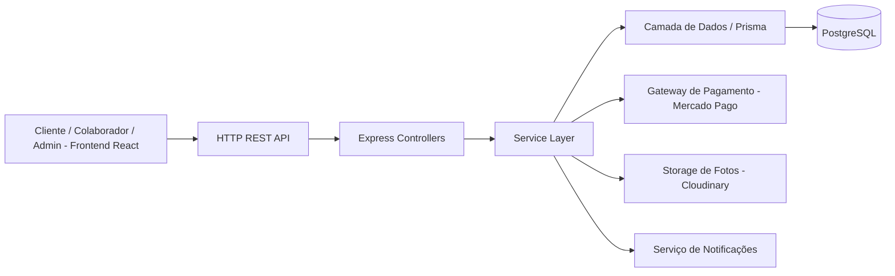
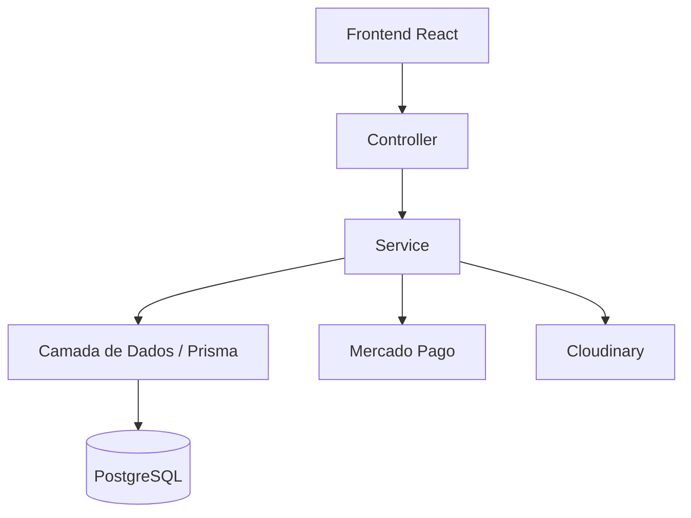

# 🏗️ ObraMaster — Gestão de Obras para Pequenas Empresas

[](#-testes)

## 🚀 Modernizando a gestão de obras com uma plataforma centralizada

### Transforme cadernos, planilhas e grupos de WhatsApp em um histórico único, auditável e acessível para todos os envolvidos na obra.

[](#️-stack-tecnológica)
[](#️-stack-tecnológica)
[](#️-stack-tecnológica)
[](#️-stack-tecnológica)
[](#-segurança)
[](#️-stack-tecnológica)

---

# 🛠️ Início rápido (desenvolvimento)

Pré-requisitos:

- Node.js 20+
- PostgreSQL 14+
- Conta sandbox no Mercado Pago (para testar pagamentos)

**Backend** (Node.js + Express):

```bash
cd backend
npm install
npm run dev
```

Por padrão, a API sobe em `http://localhost:3333`.

**Configuração de Ambiente (.env)**:
O backend precisa da string de conexão do banco, o segredo do JWT e as credenciais do Mercado Pago (sandbox).

- **Backend**: Copie `cp .env.example .env` e preencha `DATABASE_URL`, `JWT_SECRET`, `MERCADOPAGO_ACCESS_TOKEN` e `CLOUDINARY_URL`.
- **Frontend**: Copie `cp .env.example .env` e aponte `VITE_API_URL` para o backend.

**Banco de dados** (migrations):

```bash
cd backend
npx prisma migrate dev
```

**Frontend** (Vite + React + Tailwind):

```bash
cd frontend
npm install
npm run dev
```

**Testes** (local e CI):

```bash
cd frontend && npm test
cd backend && npm test
```

---

# 📌 Sobre o Projeto

**ObraCheck** é uma plataforma web multiempresa (SaaS) de gestão de obras, voltada para pequenas empresas de construção e reforma que hoje controlam tudo manualmente.

> 🎯 **Estado atual**: projeto em fase de implementação — documentação de escopo, casos de uso, regras de negócio e arquitetura já definidos; construção do MVP em andamento.

## 🎯 Problema Resolvido

### Antes:

- Cadernos e planilhas soltas
- Combinados feitos só por WhatsApp
- Cliente sem visibilidade da obra
- Cobrança e reajustes sem registro formal
- Conflitos de agenda por falta de controle

### Depois:

- Histórico único e auditável por obra
- Fotos e atualizações de andamento em tempo real
- Pagamento parcelado dentro do próprio app
- Comprovante gerado a partir do histórico registrado
- Validação automática de conflito de agendamento

---

# 🌟 Principais Funcionalidades

## 👤 Cliente

- Solicitar orçamento com valores pré-calculados por serviço
- Acompanhar o andamento da obra (status, fotos, anotações)
- Pagar pelo app (PIX, crédito ou débito), em parcelas (50% início / 50% conclusão)
- Consultar histórico de obras contratadas

## 🧰 Colaborador

- Conta própria, vinculada às obras em que foi alocado
- Registrar fotos e anotações de andamento
- Visualizar apenas as obras atribuídas a ele

## 👷 Administrador / Dono

- Gerenciar a tabela de preços da empresa
- Criar e gerenciar obras, aprovar orçamentos
- Controlar agendamentos via calendário integrado
- Atualizar o status oficial da obra (Agendada → Em andamento → Concluída)
- Registrar pagamentos e reajustes de valor
- Alocar colaboradores por obra
- Visualizar o histórico de alterações de cada obra

---

# 🧠 Arquitetura do Sistema



---

# 🏗️ Arquitetura em Camadas



---

# 📂 Estrutura de Pastas

```
obracheck/
│
├── frontend/
│   ├── src/
│   │   ├── pages/
│   │   ├── components/
│   │   ├── hooks/
│   │   ├── services/
│   │   ├── routes/
│   │   └── tests/
│
├── backend/
│   ├── src/
│   │   ├── controllers/
│   │   ├── services/
│   │   ├── repositories/
│   │   ├── models/
│   │   ├── middlewares/
│   │   └── config/
│   ├── prisma/
│   │   └── schema.prisma
│   └── tests/
│
└── docs/
    ├── escopo-do-projeto.md
    ├── casos-de-uso/
    └── arquitetura/
```

---

# ⚙️ Stack Tecnológica

## 🎨 Frontend

- React JS
- Vite
- TailwindCSS
- Axios
- React Router
- Context API

## 🛠️ Backend

- Node.js 20+
- Express
- Prisma ORM
- JWT (autenticação)
- Bcrypt (hash de senha)
- Jest / Supertest

## 🗄️ Banco de Dados

- PostgreSQL
- Modelagem multiempresa (`empresa_id` em toda tabela relevante)
- Migrations via Prisma

## 💳 Integrações

- Mercado Pago (pagamentos via PIX/crédito/débito, sandbox)
- Cloudinary (armazenamento de fotos/arquivos)

---

# 🔁 Fluxo Principal do Sistema


---

# 📋 Regras de Negócio

## 🔒 Regras Obrigatórias

- **RN1** — Pagamento só é registrado se valor ≤ saldo pendente; sem duplicidade de transação
- **RN2** — Status segue sequência obrigatória Agendada → Em andamento → Concluída, sem retrocesso; só o Admin oficializa a mudança
- **RN3** — Reagendamento só é confirmado se não houver conflito de data/hora com outra obra
- **RN4** — Toda alteração (status, pagamento, agendamento) é registrada em histórico com usuário e data/hora
- **RN6** — Obra não pode ser marcada como "Concluída" com pagamento pendente
- **RN7** — Alteração de status ou agendamento dispara notificação automática ao cliente
- **RN8** — Pagamento padrão dividido em 2 parcelas: 50% na aprovação do orçamento, 50% na conclusão da obra
- **RN9** — Isolamento total de dados entre empresas (multiempresa)

---

# 🗃️ Modelagem de Dados

## Tabela: `empresa`

| Campo       | Tipo      |
| ----------- | --------- |
| id          | UUID      |
| nome        | VARCHAR   |
| cnpj        | VARCHAR   |
| created_at  | TIMESTAMP |

## Tabela: `usuario`

| Campo         | Tipo      |
| ------------- | --------- |
| id            | UUID      |
| empresa_id    | UUID      |
| nome          | VARCHAR   |
| email         | VARCHAR   |
| senha_hash    | TEXT      |
| tipo          | VARCHAR (cliente/colaborador/admin) |
| created_at    | TIMESTAMP |

## Tabela: `obra`

| Campo           | Tipo      |
| --------------- | --------- |
| id              | UUID      |
| empresa_id      | UUID      |
| cliente_id      | UUID      |
| status          | VARCHAR (Agendada/Em andamento/Concluída/Cancelada) |
| valor_total     | DECIMAL   |
| valor_pago      | DECIMAL   |
| data_agendada   | TIMESTAMP |
| created_at      | TIMESTAMP |

## Tabela: `obra_evento` (linha do tempo / histórico)

| Campo       | Tipo      |
| ----------- | --------- |
| id          | UUID      |
| obra_id     | UUID      |
| usuario_id  | UUID      |
| tipo        | VARCHAR (foto/anotacao/reajuste/pagamento/status) |
| descricao   | TEXT      |
| created_at  | TIMESTAMP |

## Tabela: `obra_colaborador`

| Campo          | Tipo |
| -------------- | ---- |
| obra_id        | UUID |
| colaborador_id | UUID |

## Tabela: `tabela_preco`

| Campo       | Tipo    |
| ----------- | ------- |
| id          | UUID    |
| empresa_id  | UUID    |
| servico     | VARCHAR |
| valor_m2    | DECIMAL |

---

# 🌐 Endpoints da API

## Autenticação

```
POST /auth/register   (cadastro de empresa + admin)
POST /auth/login
```

## Obras

```
GET  /obras
POST /obras
GET  /obras/:id
PATCH /obras/:id/status
POST /obras/:id/andamento     (foto/anotação — Colaborador)
POST /obras/:id/pagamento     (Admin)
POST /obras/:id/colaboradores (alocação — Admin)
```

## Preços e Agenda

```
GET  /precos
POST /precos
GET  /agenda
```

## Colaboradores

```
POST /colaboradores
GET  /colaboradores
```

---

# 🔐 Segurança

## Implementado / Planejado:

- Autenticação via JWT
- Hash de senha com Bcrypt
- Isolamento de dados por empresa (multi-tenant)
- Dados sensíveis (pagamento, cliente) criptografados em trânsito (HTTPS) e repouso
- Sem armazenamento direto de dados bancários — pagamento via gateway externo, só token/ID da transação é salvo
- Conformidade com a LGPD no tratamento de dados pessoais

---

# 🧪 Testes

```
cd frontend && npm test
cd backend && npm test
```

---

# 📄 Documentação e Planejamento

Veja os arquivos de especificação para detalhes:

- `docs/escopo-do-projeto.md` — Escopo completo do projeto
- `docs/casos-de-uso/` — Especificação dos casos de uso
- `docs/arquitetura/` — Documento de arquitetura de software

---

# 📈 Roadmap

## ✏️ Fundação do Projeto

- [x] Definição de escopo e visão do produto
- [x] Especificação de casos de uso e regras de negócio
- [x] Modelagem de dados
- [x] Documento de arquitetura

## 🔨 Fase 1: MVP (até 30/09)

- [ ] Cadastro/login de empresa, admin, colaborador e cliente
- [ ] Tabela de preços por empresa
- [ ] Cadastro e gestão de obras pelo Admin
- [ ] Calendário/agenda consolidada
- [ ] Registro de andamento (fotos + anotações) pelo Colaborador
- [ ] Alocação de colaboradores por obra
- [ ] Pagamento parcelado (50/50) via PIX/cartão
- [ ] Acompanhamento de obra pelo Cliente
- [ ] Histórico/log de auditoria

## 🚀 Fase 2: Melhorias

- [ ] Chat direto entre dono e cliente
- [ ] Avaliação do serviço prestado
- [ ] Emissão de comprovante/termo em PDF
- [ ] Exportação de relatórios financeiros (PDF/Excel)
- [ ] Tela dedicada de gestão de colaboradores

---

# 🎨 Diferenciais

## 💥 O que torna o ObraCheck especial:

### Multiempresa

Qualquer empresa de obras pode usar, com dados isolados das demais

### Histórico confiável

Toda alteração registrada com usuário e data/hora — serve como comprovante

### Pensado para o dia a dia da obra

Fotos, anotações e agenda no lugar do caderno e do WhatsApp

### Mobile-first

Feito pra ser usado no celular, direto do canteiro de obras

---

# 🤝 Contribuição

## Padrões:

- Componentização e separação em camadas (Controller/Service/Repository)
- Commits organizados por feature
- Pull Requests com pelo menos 1 revisão antes do merge

---

# 📜 Licença

Este projeto é acadêmico (TCC) e pode ser adaptado para fins educacionais, comerciais ou evolutivos conforme necessidade.

---

# 🏗️ ObraCheck

### Simples para a sua empresa. Transparente para o seu cliente.

## "Sua obra merece mais que um caderno."


## Como rodar o projeto

### Frontend
cd frontend
npm install
npm run dev -- --host

### Backend
cd backend
npm install
node index.js

## Banco de dados
PostgreSQL (Supabase) + Prisma. Tabelas: Empresa, Usuario.
Configure `DATABASE_URL` no `backend/.env` com a connection string do Supabase
(Project Settings > Database > Connection string, modo Pooler) e rode:
`npx prisma migrate dev` (dentro de backend/)

## Repositório
https://github.com/Jaqueline-BCO-97/Gestao-de-Obras